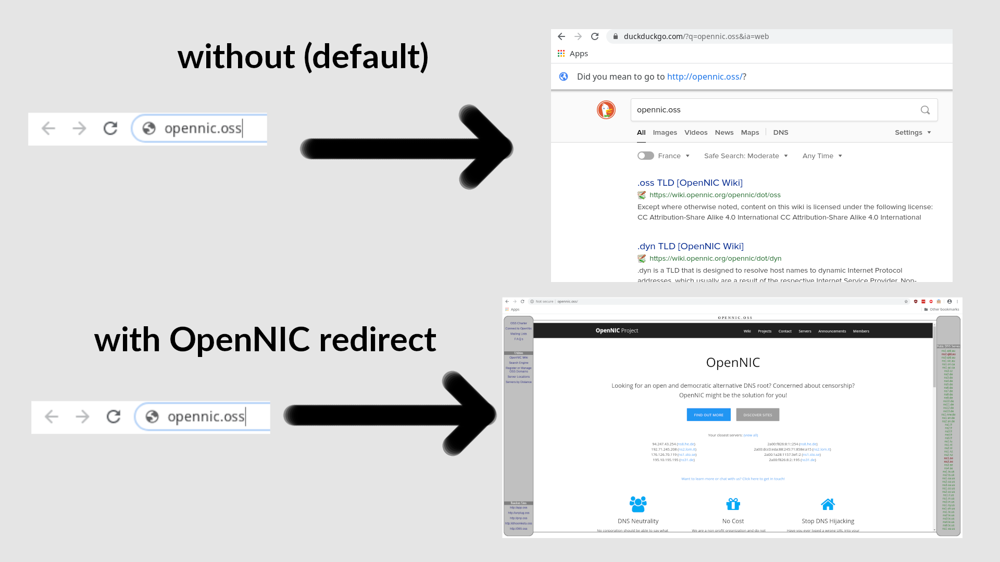

#  OpenNIC redirect

_Previously named: OpenNIC (enabled) omnibox_

Prevent Chrome from searching the OpenNIC url you just entered.
This is because Chrome doesn't (want to) recognize OpenNIC TLDs.

## Usage

## Installation

_TODO, Pending review on Google Play store_

## How it works

Every time the user types in a OpenNIC domain without `http://`
or a path eg. `/index.html`, Chrome interprets that as a search query.

It will use the default search engine listed under
<chrome://settings/searchEngines>. We intercept the search query
url before it loads eg. we get <https://duckduckgo.com/?q=opennic.oss>.

We then extract the query, and check if it's an OpenNIC URL.
If it is, we redirect the browser to it using the webRequest API.

## Caveats

The giant infobar "Did you mean to go to http://opennic.oss/" can't be dismissed
by the extension.

You need to use one of the 5 default search engines
(Google, Bing, Yahoo, DuckDuckGo and Ecosia). Others can be added,
but I'm too lazy to do so **if there is no demand**.

## Developer notes

- `browser-polyfill.js` is copied from `webextension-polyfill` with the command
  `cp node_modules/webextension-polyfill/dist/browser-polyfill.js .`
- To see the console when debugging with `web-ext run`, go to `about:debugging` > This Firefox > OpenNIC redirect > Inspect > Console.